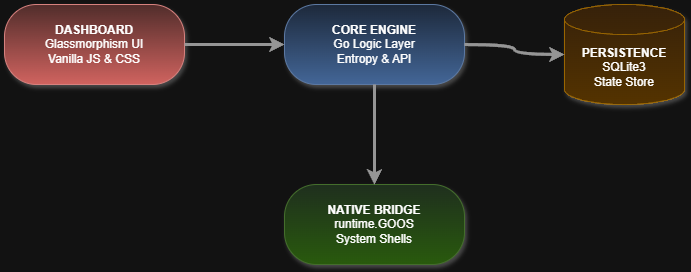

````markdown
# CredDrift Entropy Driven Secret Analysis Engine

CredDrift is a high performance security engine built in Go. It identifies and tracks hardcoded credentials within a local workspace. It uses mathematical probability to find high randomness strings that represent active API keys and tokens.

## System Architecture

The diagram below shows the interaction between the Go backend, the SQLite datastore, and the glassmorphism UI.



<details>
<summary>Click to see Source XML for Draw.io</summary>

```xml
<mxfile host="app.diagrams.net">
  <diagram name="CredDrift Architecture">
    <mxGraphModel dx="1000" dy="1000" grid="1" gridSize="10" guides="1" tooltips="1" connect="1" arrows="1" fold="1" page="1" pageScale="1" pageWidth="827" pageHeight="1169">
      <root>
        <mxCell id="0" />
        <mxCell id="1" parent="0" />
        <mxCell id="node_frontend" value="Frontend Application&#xa;(HTML5/CSS3/Vanilla JS)" style="rounded=1;whiteSpace=wrap;html=1;fillColor=#f8cecc;strokeColor=#b85450;" vertex="1" parent="1">
          <mxGeometry x="320" y="80" width="200" height="60" as="geometry" />
        </mxCell>
        <mxCell id="node_backend" value="Go Backend API &amp; Scanner&#xa;(Native OS Hooks via runtime)" style="rounded=1;whiteSpace=wrap;html=1;fillColor=#dae8fc;strokeColor=#6c8ebf;" vertex="1" parent="1">
          <mxGeometry x="320" y="200" width="200" height="60" as="geometry" />
        </mxCell>
        <mxCell id="node_sqlite" value="SQLite Datastore&#xa;(State &amp; GRC Metrics)" style="shape=cylinder3;whiteSpace=wrap;html=1;boundedLbl=1;backgroundOutline=1;size=15;fillColor=#ffe6cc;strokeColor=#d79b00;" vertex="1" parent="1">
          <mxGeometry x="370" y="320" width="100" height="80" as="geometry" />
        </mxCell>
        <mxCell id="edge_1" value="REST / JSON" style="endArrow=classic;html=1;exitX=0.5;exitY=1;exitDx=0;exitDy=0;entryX=0.5;entryY=0;entryDx=0;entryDy=0;" edge="1" parent="1" source="node_frontend" target="node_backend">
          <mxGeometry width="50" height="50" relative="1" as="geometry" />
        </mxCell>
        <mxCell id="edge_2" value="SQL" style="endArrow=classic;html=1;exitX=0.5;exitY=1;exitDx=0;exitDy=0;entryX=0.5;entryY=0;entryDx=0;entryDy=0;entryPerimeter=0;" edge="1" parent="1" source="node_backend" target="node_sqlite">
          <mxGeometry width="50" height="50" relative="1" as="geometry" />
        </mxCell>
      </root>
    </mxGraphModel>
  </diagram>
</mxfile>
````

\</details\>

-----

## Operational Workflow

CredDrift uses a strict state machine logic. The scanner is restricted to the Current Project Root Directory to ensure precision and prevent noise from system files. All actions require the user to pick secrets using checkboxes before clicking action buttons.

### Core Operational Logic:

  * Detection: The engine walks through the workspace and looks for high entropy strings.
  * Selection Required: No state changes happen unless you select items with checkboxes.
  * Ignore State: Ignored secrets move to a separate database state and stay hidden from the main view.
  * Restoration: You can find ignored keys in the Ignored view and mark them as important to bring them back.

-----

## Technical Core Shannon Entropy

The detection logic is grounded in the Shannon Entropy formula. By calculating the bit rate of information in a string the engine tells the difference between standard code and real cryptographic keys.

$$H(X) = -\sum_{i=1}^{n} P(x_i) \log_2 P(x_i)$$

Strings that exceed the defined entropy threshold are flagged for immediate risk assessment.

-----

## Technical Installation and Deployment

### 1\. Prerequisites

  * Go Toolchain: Version 1.21 or higher.
  * SQLite3: Required for local state storage.

### 2\. Dependency Management

Verify and download the required modules:

```bash
go mod tidy
go mod verify
```

### 3\. Production Build and Optimization

Compile the binary using optimized linker flags to strip debug symbols and minimize the file size:

```bash
go build -ldflags="-s -w" -o creddrift.exe main.go
```

### 4\. Database Initialization

The application handles database setup on startup. To reset the state machine and clear all history:

```bash
rm creddrift.db
```

-----

## Cross Platform Native Integration

CredDrift uses the Go runtime package to bridge web inputs with native system calls:

  * Windows: Uses PowerShell for native folder pickers and explorer.exe for showing files.
  * macOS: Triggers AppleScript for directory selection and open for navigation.
  * Linux: Hooks into zenity for GUI selection and xdg open for file interaction.

-----

© 2026 CredDrift Security

```
```