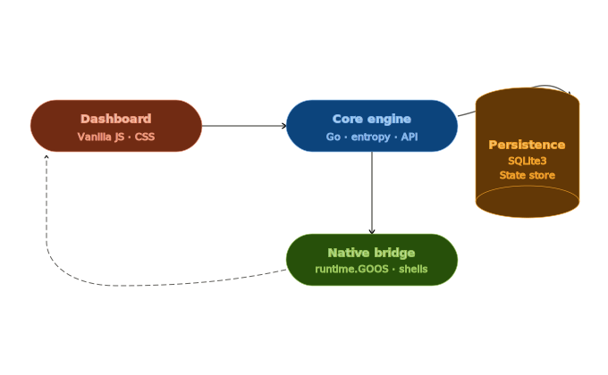
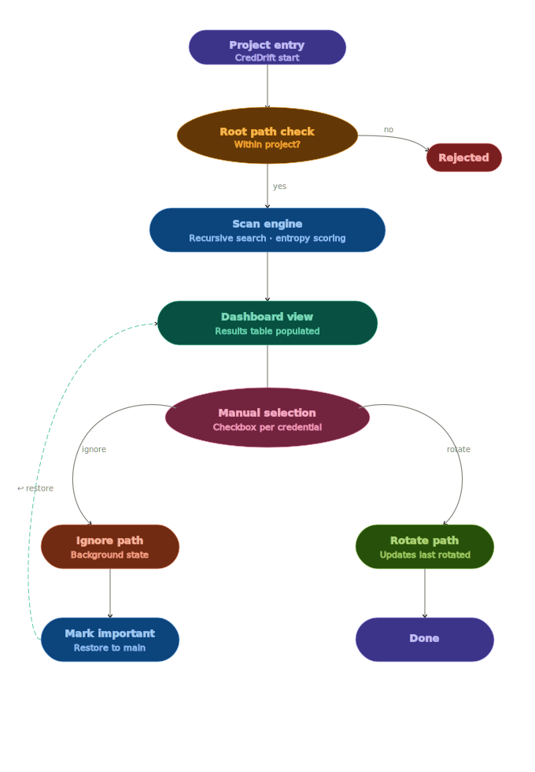

# CredDrift

CredDrift is an advanced, high-level security tool designed for managing secret drift within your local codebase. In modern software development, credentials—such as API keys, database passwords, and private tokens—often leak and drift across different source files over time. CredDrift empowers cybersecurity engineers and operations teams to aggressively discover, audit, and manage these hardcoded secrets before they compromise your infrastructure.

By operating with a native Go-powered engine and a local SQLite datastore, CredDrift ensures that no sensitive intellectual property ever leaves your workstation during an audit.

## System Architecture

CredDrift utilizes a decoupled local architecture. The environment primarily consists of a high-throughput Go backend, an embedded SQLite database for maintaining the historical state of secret drift, and a lightweight dashboard built on modern web standards.



### Operational Flow

The engine enforces a strict state-machine workflow to analyze workspaces, identify high-risk strings, and catalog findings securely. The tool places the engineer at the center, requiring explicit acknowledgement and classification of discovered secrets.



## Technical Capabilities

### Secret Detection via Shannon Entropy

To distinguish true cryptographically generated secrets from ordinary code structures, CredDrift leverages information theory. The scanning engine utilizes the Shannon Entropy mathematical model to evaluate the randomness and density of strings in your workspace.

The entropy $H$ for a given string $X$ is calculated using the following formula:

$$H(X) = -\sum_{i=1}^{n} P(x_i) \log_2 P(x_i)$$

Where $x_i$ represents a character from a character set of size $n$, and $P(x_i)$ is the probability of its occurrence in the string. Strings that exceed configured entropy thresholds are flagged as potential secrets. This programmatic approach drastically reduces false positives while actively detecting highly randomized keys (like RSA private keys, JWTs, or AWS access tokens).

### Cross-Platform Native Integration

CredDrift is engineered to function flawlessly across diverse operating systems by heavily utilizing the native capabilities of the Go `runtime` library. This cross-platform logic allows the web-based dashboard backend to intuitively and securely interact with the user's host filesystem independent of the browser sandbox.

The backend dynamically maps user input into secure OS-level process executions:
*   **Windows**: Invocations via PowerShell to spawn native directory pickers and Explorer views.
*   **macOS**: Execution of native AppleScript commands to control the Finder interface and folder dialogs.
*   **Linux**: Broad compatibility using `zenity` for GUI selection prompts and `xdg-open` for directory traversal without strictly coupling to a single desktop environment.

## Installation and Deployment

### 1. Prerequisites
*   Go (version 1.21 or higher)
*   SQLite3

### 2. Dependency Sourcing

Clone the repository and verify the integrity of the Go modules:

```bash
git clone https://github.com/theprideofwolves/creddrift.git
cd creddrift
go mod tidy
go mod verify
```

### 3. Optimized Build

To ensure maximum runtime performance and a minimal executable footprint, compile the binary using optimized linker flags. Passing `-s -w` strips symbol tables and debugging DWARF data out of the final executable:

```bash
# Build binary for Linux/macOS
go build -ldflags="-s -w" -o creddrift main.go

# Build binary for Windows
go build -ldflags="-s -w" -o creddrift.exe main.go
```

### 4. Database Reset / Initialization

CredDrift stores its state in an embedded SQLite datastore (`creddrift.db`). 
To reset the datastore to a pristine baseline prior to a fresh security audit, remove the file manually:

```bash
# Unix / macOS
rm -f creddrift.db

# Windows (PowerShell)
Remove-Item -Force creddrift.db
```

*(The schema will be automatically generated upon the next execution.)*

## Executing a Security Audit

Run the optimized binary to initialize the local web server and background scanner:

```bash
# Unix / macOS
./creddrift

# Windows
.\creddrift.exe
```

Navigate to your command interface at `http://localhost:8080` to manage your ongoing security posture.